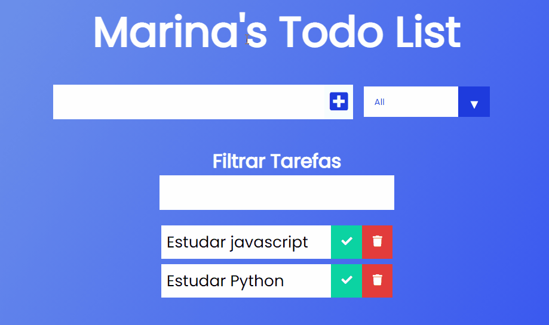
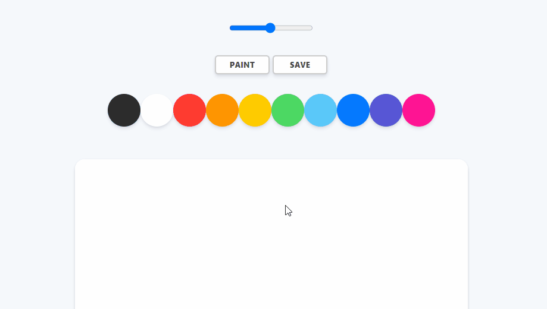

# Vanilla JavaScript Projects

 

<h2 align="center">
Projetos feitos com JavaScript puro para estudo dos fundamentos de front-end.
</h2>

## 🛠 Tecnologias

As seguintes ferramentas foram usadas na construção do projeto:

&nbsp;
&nbsp;
&nbsp;

## Projetos

 
<h2>
Todo List - JS, HTML  & CSS | 
<a href="https://codepen.io/marina09/pen/JjRNQzZ">Live-demo</a> 
</h2>

 
<h2>
PaintJS - JS, HTML, Canvas  & CSS | 
<a href="https://codepen.io/marina09/pen/vYXmMLq">Live-demo</a> 
</h2>

